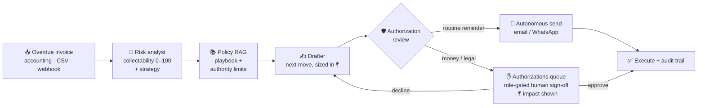
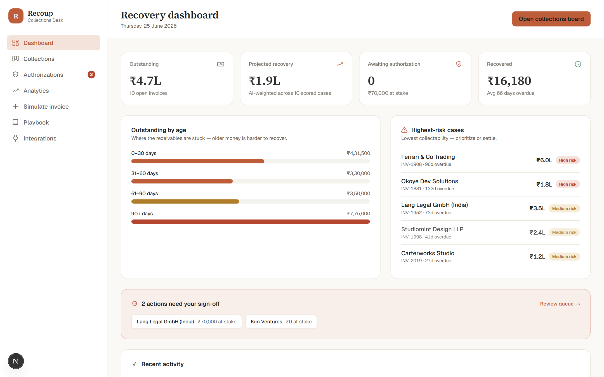
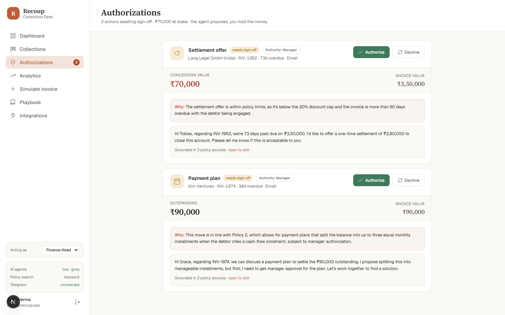
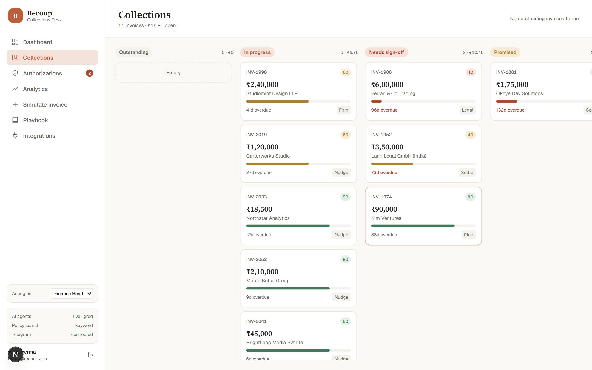
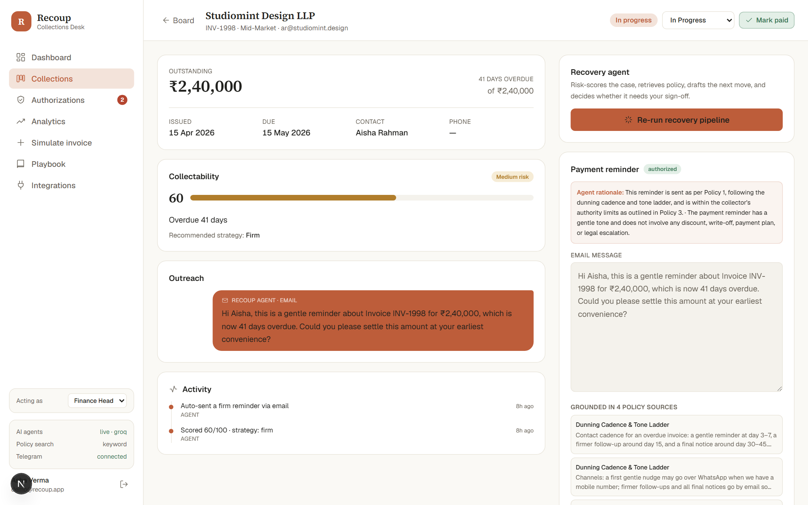
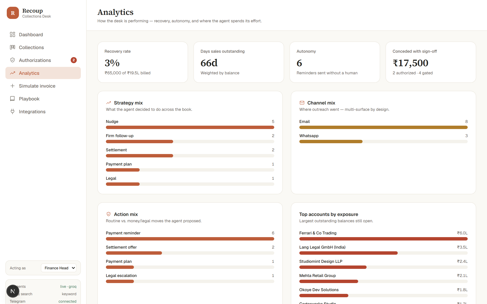
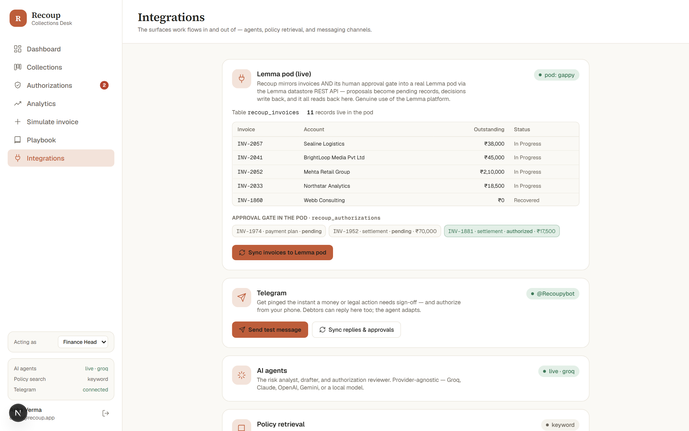
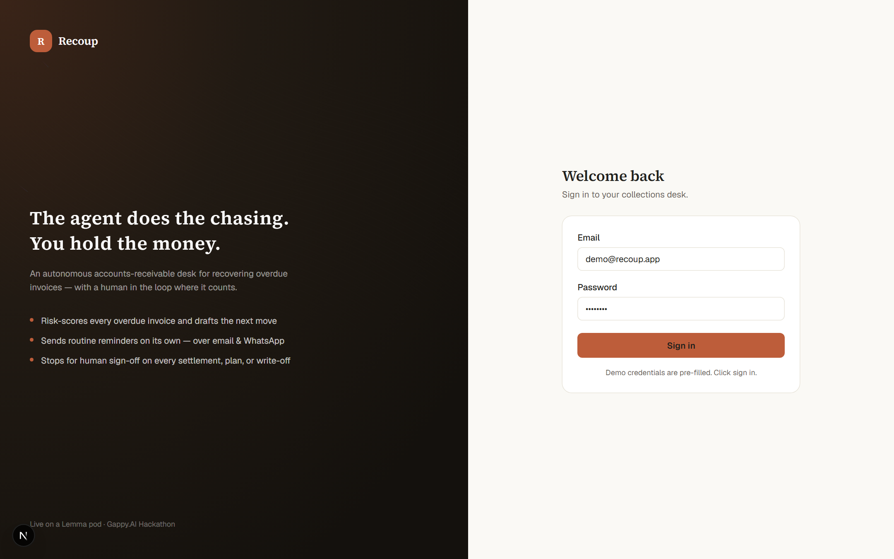
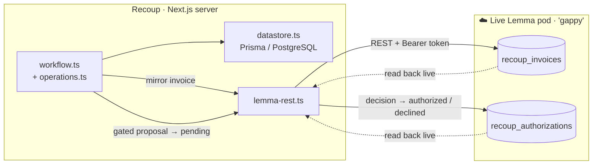

# Recoup — AI AR-Collections & Cash-Recovery Desk


An **agentic accounts-receivable desk** that recovers overdue invoices for small
businesses — built for the **Gappy.AI National AI Hackathon (powered by the
Lemma SDK)**.

> **The one-line pitch:** the agent does the collections work; the human holds the
> money. Routine dunning runs autonomously — but the moment a real-money or legal
> move is on the table (a settlement discount, a payment plan, a write-off, a
> legal escalation), it **stops and waits for human authorization.**

Indian MSMEs have trillions of rupees locked up in late payments, and chasing them
is slow, emotional, inconsistent work. Recoup ingests overdue invoices from your
accounting system, **risk-scores collectability**, **drafts the next move grounded
in your collections policy**, **sends routine reminders itself**, and **routes
every money/legal decision to a human** — all on a finance-grade desk.


> **Problem statement:** a *bring-your-own-idea* submission (explicitly allowed by
> the rules), closest in shape to the official **#5 "AI Sales / Founder Follow-up
> CRM"** — track conversations, summarize history, suggest next actions, draft
> follow-ups — but applied to **money owed**, where the follow-ups carry real
> financial stakes and a hard human-approval gate.

---

## The core loop



Every step is persisted and visible. Watch it run from **Simulate invoice**, or
hit **⚡ Run recovery** on the board to process the whole outstanding book.

---

## Screens



| Authorizations — the money gate | Collections board |
|---|---|
|  |  |

| Invoice case — risk · thread · action | Analytics |
|---|---|
|  |  |

**Integrations — running on a live Lemma pod** (invoices *and* the approval gate
mirrored into the pod, read back live):



A premium split-panel sign-in:



---

## Why the approval gate is the product

Lemma's brief: *"Don't build a chatbot. Build a workspace where AI can do real
work."* and *"The unlock isn't more agent autonomy — it's **approvals**: agents
doing real work, with a human in the loop where it counts."*

Collections is the textbook case. A reminder is safe to automate. A 15% settlement
on a ₹6,00,000 invoice, a three-month payment plan, a write-off, or a hand-off to
legal **are not** — they move money and carry legal weight. Recoup encodes exactly
that line:

- **The gate is deterministic, not vibes.** Any discount, plan, write-off, or
  legal step is gated in code (`reviewAction` in `src/lib/lemma/agent.ts`). The LLM
  can *add* friction (flag a risky reminder) but can **never** wave a money move
  through. The gate shouldn't depend on a model's mood.
- **Authorizations show the money.** Each queued action displays the ₹ at stake,
  the agent's rationale, and the policy it's grounded in — so a human decides with
  full context in seconds.
- **Offers are policy-bounded.** Settlement discounts, plan length, and escalation
  thresholds come from your **playbook** via RAG — the agent can't invent a 40%
  discount when policy caps it at 20%.

---

## Built "Lemma-shaped" (mapped to a Lemma *pod*)

> **Status (honest + scoped):** Recoup **genuinely integrates with a live Lemma
> pod.** It provisions `recoup_invoices` + `recoup_authorizations` tables in a real
> pod and, through the **Lemma datastore REST API**, mirrors invoices **and the
> human approval gate** — every gated money/legal proposal becomes a `pending`
> record and each decision writes back (`authorized`/`declined` + decider), all read
> back live on the **Integrations** page. Verified against pod `gappy`
> (`src/lib/lemma/lemma-rest.ts`; `INV-1881` → `authorized/Asha Verma`). The
> **official `lemma-sdk` npm package** is also wired up for real: the SDK Explorer's
> **Browser SDK** tab loads it directly in the browser and reads the live pod with
> the genuine `LemmaClient` (`client.pods/tables/records`). **Scope:** the server
> talks to the pod over the **datastore REST API** (token kept server-side); the
> npm `lemma-sdk` runs **in the browser** (its intended surface — it statically
> imports `supertokens-web-js` and can't load in a Node server runtime), opt-in via
> `NEXT_PUBLIC_LEMMA_TOKEN`. The agents/workflow still run in the local
> "Lemma-shaped" layer. Set `LEMMA_POD_ID` + `LEMMA_TOKEN` in `.env` to activate;
> see [docs/LEMMA_INTEGRATION.md](docs/LEMMA_INTEGRATION.md).

The whole architecture is a 1:1 mapping onto Lemma's pod primitives, behind a thin
layer in `src/lib/lemma/`, so the real SDK swaps in **without changing the UI or
workflow**:

| Lemma pod primitive  | Recoup (today)                                          | File |
|----------------------|---------------------------------------------------------|------|
| **Tables**           | Accounts, invoices, outreach, proposed actions (Prisma) | `src/lib/lemma/datastore.ts` |
| **Files** (knowledge)| Collections playbook → chunked + embedded for retrieval | `src/lib/lemma/docstore.ts` |
| **Agents** (scoped)  | Risk analyst · drafter · authorization reviewer (Claude)| `src/lib/lemma/agent.ts` |
| **Workflows**        | `processInvoice()` pipeline                             | `src/lib/lemma/workflow.ts` |
| **Approvals**        | Money/legal actions wait for human sign-off            | `src/app/(app)/authorizations` |
| **Apps (desks)**     | Dashboard · board · case view · authorizations          | `src/app/(app)/**` |
| **Surfaces**         | Accounting webhook · email/WhatsApp replies · **Telegram** (two-way) | `src/lib/lemma/integrations.ts` · `telegram.ts` |

### How work moves — `input → state → action → approval → outcome`

```
input     An overdue invoice lands from the accounting system
state     It becomes an Invoice row; the risk agent scores collectability + strategy
action    The drafter proposes the next move, sized within policy
approval  Money/legal moves sit in the Authorizations queue — a human signs off
outcome   Outreach sent / concession recorded; the invoice advances on the board
```

### Live Lemma pod integration

Recoup runs on a real Lemma pod: it mirrors invoices **and the human approval gate**
into the pod over the Lemma datastore REST API, and reads them back in the UI
(`src/lib/lemma/lemma-rest.ts`, verified against pod `gappy`).



---

## Integrations & the closed loop

Recoup is a two-way system, not a one-shot generator:

- **Telegram (human-in-the-loop, in your pocket).** The moment a money/legal action
  is proposed, the manager gets a Telegram ping with the ₹ at stake and inline
  **Authorize / Decline** buttons — and can act from their phone (`approve INV-1952`
  or the button). Debtors can reply over Telegram too. Outbound alerts need only a
  bot token; inbound works via the production webhook (`/api/telegram`) **or** the
  "Sync replies & approvals" button (`getUpdates` polling — no public URL needed).
- **Closed reply loop.** A debtor reply on any channel (`POST /api/reply`, or the
  in-app "Simulate debtor reply") is ingested and the agent **re-reads the case and
  adapts**: a promise-to-pay flips the next move to a **payment plan**, a dispute
  **pauses the cadence** per policy, hostility escalates. State moves on its own.
- **Audit trail.** Every ingest, score, reminder, proposal, authorization, decline,
  reply, and payment is logged with **who, what, and ₹** — shown on the dashboard
  and per-case timeline. Collections is a regulated activity; the trail is the point.
- **Partial payments.** Record full or partial payments; the balance and the
  dashboard recovery numbers update live.

Everything degrades gracefully — with no Telegram token the desk runs fully; the
Integrations page shows connection status and a 3-step setup.

## Stack

- **Next.js 16** (App Router, Server Actions) · **TypeScript** · **Tailwind v4**
- **Prisma + PostgreSQL** (Neon) — serverless-ready for Vercel; point
  `DATABASE_URL` at any Postgres locally (money stored as integer paise; ₹
  rendered in the Indian lakh/crore grouping)
- **Provider-agnostic AI** — **Groq** (free + fast), or Claude, OpenAI, Gemini,
  OpenRouter, Ollama, or any OpenAI-compatible endpoint — chosen by env
- **Auth** — signed JWT cookie (`jose`) + bcrypt; login required, route-guarded
- **Voyage AI** (optional) — semantic policy search; falls back to keyword search

---

## Run it

```bash
npm install
cp .env.example .env        # set DATABASE_URL + DIRECT_URL (Postgres) and AUTH_SECRET
npm run db:push             # apply the schema to your Postgres (prisma db push)
npm run db:seed             # demo user, 5-policy playbook, 11 invoices
npm run dev                 # http://localhost:3000
```

> **Postgres in one line:** spin up a free [Neon](https://neon.tech) database (or
> any local Postgres) and paste its connection string into `DATABASE_URL` /
> `DIRECT_URL`. `npm run db:reset` re-pushes the schema and reseeds from scratch.

**Login:** `demo@recoup.app` / `demo1234` (pre-filled on the login page).

> **No AI key?** It still demos end-to-end: every agent has a deterministic
> heuristic, and policy search degrades to keyword matching. The sidebar shows
> which mode is live. Add `GROQ_API_KEY` or `ANTHROPIC_API_KEY` for live AI.

### Environment

| Variable            | Required | Purpose |
|---------------------|----------|---------|
| `AUTH_SECRET`       | yes      | Signs the session cookie. |
| `GROQ_API_KEY`      | recommended | Free + fast live AI ([console.groq.com/keys](https://console.groq.com/keys)). |
| `ANTHROPIC_API_KEY` | alt.     | Use Claude (Sonnet 4.6 / Opus 4.8) instead. |
| `VOYAGE_API_KEY`    | optional | Semantic playbook search; else keyword fallback. |
| `TELEGRAM_BOT_TOKEN` + `TELEGRAM_MANAGER_CHAT_ID` | optional | Telegram alerts + approve-from-phone + debtor replies. |

Also supported: `OPENAI_API_KEY`, `GEMINI_API_KEY`, `OPENROUTER_API_KEY`, or a
custom `AI_BASE_URL` + `AI_API_KEY` + `AI_MODEL`, plus `AI_PROVIDER` to force one.

---

## Demo script (2 minutes)

1. **Log in** → land on the **Recovery dashboard**: outstanding ₹, AI-projected
   recovery, **money awaiting authorization**, recovered, and an aging breakdown.
2. **Collections board** → click **⚡ Run recovery on N outstanding**. Watch
   invoices get scored, get a strategy, and split: low-overdue ones **auto-send a
   reminder** (note the WhatsApp vs email channel) and move to *In progress*;
   money/legal ones move to *Needs sign-off*.
3. **Authorizations** → the queue fills with **settlements, payment plans, and
   legal escalations**, each showing the **₹ at stake**, the agent's rationale, and
   the policy it cited. **Authorize** one (it sends + advances) or **Decline &
   redraft**.
4. **Open a case** → see the collectability meter, the outreach thread, the
   proposed action, and the **activity timeline**. Edit the message, then
   **Authorize & send**. Record a **partial payment**, or **Mark paid** to close it.
5. **Closed loop** → on a hostile/legal case, use **Simulate a debtor reply** with
   "*sorry, cash is tight — can we split it into installments?*". Watch the agent
   **re-score and flip from legal escalation to a payment plan**, logged in the
   timeline. (Same path as `POST /api/reply`.)
6. **Telegram** (optional) → with a bot connected, money/legal proposals ping your
   phone; reply `approve INV-1952` to authorize from anywhere.
7. **Simulate invoice** → drop in an overdue invoice (try ~52 days) → watch the
   full pipeline propose a **settlement** that lands in Authorizations.
8. **Playbook** → add/inspect the policy the agent grounds its offers in.

### Or drive it headless

```bash
curl -X POST http://localhost:3000/api/ingest \
  -H "Content-Type: application/json" \
  -d '{"accountName":"Vantage Interiors","accountEmail":"ar@vantage.in",
       "contactName":"Neha Kulkarni","segment":"SMB","invoiceNumber":"INV-9001",
       "amountPaise":14500000,"issueDate":"2026-04-01","dueDate":"2026-05-01"}'
# → { invoiceId, riskScore, strategy, kind, requiresApproval, financialImpactPaise, autoSent, ... }
```

---

## What makes Recoup different

| | Generic AI chatbot / support clone | **Recoup** |
|---|---|---|
| Stakes | Drafts text; nothing irreversible | **Moves real money** — settlements, write-offs, legal |
| Human-in-the-loop | "Are you sure?" everywhere, or nowhere | **Deterministic, role-tiered gate** only where money/legal is at stake |
| Grounding | Free-form LLM | Offers **bounded by your playbook** via RAG (can't exceed authority) |
| Autonomy | All-or-nothing | **Routine dunning auto-sends; risky moves stop** |
| Two-way | One-shot replies | **Closed loop** — debtor replies re-run the agent (promise→plan, dispute→pause) |
| Reach | In-app only | **Telegram** — authorize from your phone; live, verified |
| Lemma use | Chat over an API | **Runs on a live pod** — datastore + approval gate mirrored, read back |
| Trust | Opaque | **Full audit trail** — who authorized what, for how much |

---

## Design decisions (and why we defend them)

The hackathon rewards *how you scoped and defended decisions* — here are the load-bearing ones:

- **The approval gate is deterministic, not model-decided.** `reviewAction` gates any
  money/legal action in code; the LLM can *add* friction but never remove it. A gate
  that depends on an LLM's mood isn't a gate. *(`src/lib/lemma/agent.ts`)*
- **Use the npm SDK where it actually runs — the browser — and REST on the server.**
  The published `lemma-sdk` statically imports `supertokens-web-js`, so it can't load
  in a Node server runtime; we run the genuine `LemmaClient` **client-side** (SDK
  Explorer → Browser SDK) and call the Lemma **REST API** from the server, with Prisma
  as the offline fallback — real SDK use *and* a demo that always runs.
  *(`src/lib/lemma/sdk/browser.ts`, `src/lib/lemma/lemma-rest.ts`)*
- **Money as integer paise, ₹ Indian grouping.** No floating-point drift on financial
  figures; the locale renders lakhs/crores judges expect.
- **Provider-agnostic AI with a heuristic fallback.** Groq/Claude/OpenAI/… *and* it
  still demos end-to-end with **zero API keys** — execution doesn't depend on a key.
- **Forced, varied seed for the authorizations queue.** Live LLMs pick milder
  strategies, which would leave the demo's money-gate empty; the seed guarantees a
  populated, varied queue (settlement · plan · legal) so the core story always shows.
- **Bring-your-own-idea, framed honestly.** Not a 1:1 match to a canned statement
  (closest to #5) — and every "Lemma" claim is scoped to exactly what's wired.

---

## How judging criteria map

- **Problem clarity** — a specific user (an SMB collections owner) and a real,
  high-stakes, multi-channel workflow with persistent state, money, and login.
- **Product judgment** — one tight loop; the autonomous/gated split is the core
  product decision; offers are policy-bounded; the gate is deterministic by design.
- **Execution** — runs end-to-end with a single `npm` flow; works with or without
  any API key; finance-grade UI with real DSO/aging/projection metrics.
- **Lemma SDK use** — Recoup runs on a **live Lemma pod**: it provisions a table
  and mirrors invoices through the Lemma datastore REST API, reading them back in
  the UI (`src/lib/lemma/lemma-rest.ts`, verified against pod `gappy`). The
  **official `lemma-sdk` npm package** is wired in too — the SDK Explorer's
  **Browser SDK** tab drives the genuine `LemmaClient` against the live pod
  client-side (`src/lib/lemma/sdk/browser.ts`). The rest of the architecture is a
  1:1 map onto Lemma's primitives behind one layer (`src/lib/lemma/`); the
  agents/workflow/approval gate use the REST/local path because the npm SDK can't
  import in a Node server runtime — details in
  [docs/LEMMA_INTEGRATION.md](docs/LEMMA_INTEGRATION.md).

---

## Docs & license

- **[docs/ARCHITECTURE.md](docs/ARCHITECTURE.md)** — the work-movement model, the
  Lemma abstraction layer, the authorization gate, data model, and file map.
- Open-source under the **[MIT License](LICENSE)**.
